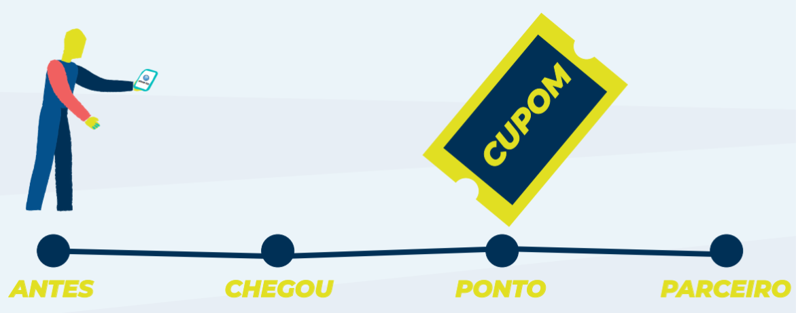

# Tour Go

Projeto com temática do turismo desenvolvido para o evento "Hackatour 2019", que ocorreu em junho de 2019 no Sebraelab (São Luís, MA) 
Este projeto terminou o evento em segundo lugar e contou além deste protótipo, um pitch de apresentação de 3 minutos.  

Nesta aplicação, o principal objetivo é realizar o mapeamento e conexão entre todos os atores que fazem parte da cadeia turística da região metropolitana de São Luís, mapeando pontos de entrada e saída da cidade, apoiadores, empresas, experiências, serviços e pontos turísticos. 
Utiliza-se de referência o famoso jogo “Pokemon Go”, onde o turista captura locais da cidade e coloca em um álbum de viagem. A aplicação identifica se o turista está próximo de um ponto turístico através de seu GPS, permitindo a ele tirar uma foto e preencher um álbum de figurinhas dentro da aplicação, percorrendo um roteiro turístico que pode ser religioso,  experiência, vivência, festas, integração e colaboração. Dessa forma, incentivando a visita de todos os pontos e completar sua coleção, aumentando a visitação nos pontos inclusos no roteiro e gamificando a experiência do turista, sendo possível disponibilizar cupons de desconto de empresas, lojas ou parceiros nas proximidades de cada ponto turístico visitado, gerando além da movimentação o direcionamento do turista para as melhores experiências possíveis.

